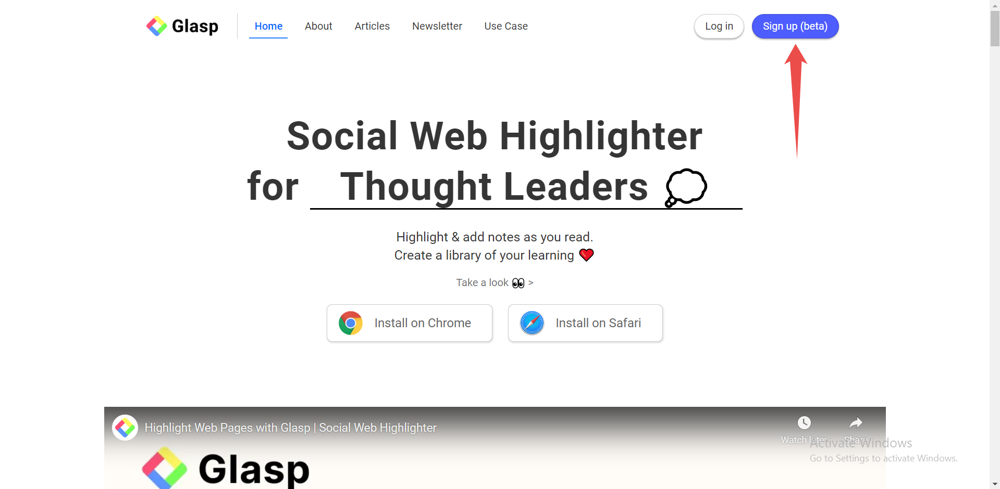

 

# Glasp, The Social Bookmarking Tool for Knowledge Sharing and Collaboration

## TABLE OF CONTENTS
## Introduction
## What is Glasp
## Features of Glasp
## How to use Glasp
## Benefits of Using Glasp
## Conclusion

## Introduction

Are you tired of losing great ideas you come across while surfing the web? Glasp is a social web highlighter that will transform the way you save and organize great pieces of inspiration. Glasp allows you to easily save text snippets from any website and access them on the move. You'll also come across new content posted by others with similar interests. In this article, we'll go through Glasp's capabilities and benefits, as well as how to use this game-changing technology. So buckle up, because your web browsing experience is going to become a lot smarter.

## What is Glasp

Glasp is like having an internet highlighter. You can save the juicy chunks of text from any webpage and then organize them however you wish. But here's the catch: Glasp is also a social networking site. That means you can see what other people are highlighting and find new content that is relevant to your interests. It's like a treasure mine of information just waiting for you to explore.

## Features of Glasp

Alright, let's dive into some of the sweet features of Glasp.

- It's quite simple to use. You only need to install the Chrome extension to get started. When you locate something you wish to save, simply highlight it and press the save button. Glasp will keep it safe for you.

- You can categorize your snippets into different collections so you never forget what you've saved.

- It's a social networking site. That means you can connect with other people who share your interests and discover new content.

- If you're feeling very generous, you can even share your own collections with the rest of the globe.

- Glasp also offers a search option, which allows you to go through your saved snippets as well as other users' collections. It's like having a search engine for some of the best internet ideas and quotes.

In a nutshell, Glasp is a tool that allows you to easily store and organize the best bits of text from the internet while also linking you with other smart people. If you're serious about learning and progressing, you should check it out.

## How to use Glasp

Let's get you started with Glasp. First and foremost, you must register for an account. Go to [Glasp](https://glasp.co) and click the "Sign Up" button. You can sign up using your Google account.

  

After clicking on the Sign-up button, you can continue by signing up with your Google account.

.png) 

Once you're signed up, it's time to install the Glasp Chrome extension. Click on the "Install on Chrome" button, then you'll get redirected to the Chrome web store where you can click on "Add Extension" to install it.

.png) 

.png) 

To start using the Glasp extension, you need to pin the extension icon on the Chrome taskbar.

.png) 

You can now always access the Glasp functionality by clicking on the pinned icon on the taskbar.

.png) 

Now that you've installed the extension and pinned it to the taskbar, you can begin highlighting. When you come across a text that you want to preserve, simply highlight it and click the Glasp icon on your Chrome toolbar. Glasp will save the highlighted content for you automatically. If you like, you may add a message to your highlight or leave it as is.

But it's when it comes to organizing your highlights that Glasp really shines. To access the Glasp dashboard, click the Glasp icon in your Chrome toolbar. You can then build collections to organize your highlights however you choose. You can name your collections, describe them, and even share them with others.

.png) 

Glasp also features artificial intelligence functionality that can help provide insights into a highlighted piece of text.

.png) 

## Benefits of Using Glasp

* Easily save and organize information from the internet

* Highlight and save snippets of text you'll like to    remember

* Discover new content and perspectives by following other users

* Organize your saved information into collections

* Collaborate on research or group projects by sharing collections with others

* Access saved information from anywhere

* Build a digital library of knowledge that will be useful for years to come.

## Conclusion

Glasp is, at the end of the day, a tool that makes sense. It addresses a problem that many of us face: the overwhelming amount of information available on the internet. Glasp allows you to effortlessly save and organize the things that are most important to you, while simultaneously discovering new information and ideas via the platform's social capabilities. It's a no-brainer for anyone looking to simplify their digital life and establish a knowledge library that they can access from anywhere. So go ahead and try it out for yourself to see why Glasp is the future of digital learning and research.

To discover more about Glasp, check out these [resources](https://glasp.co/articles/).

